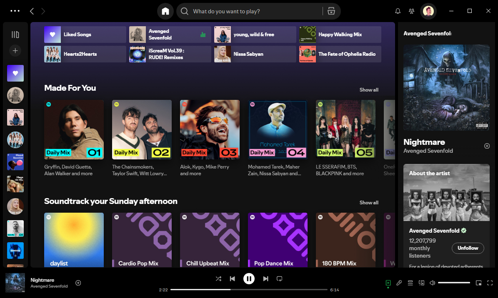
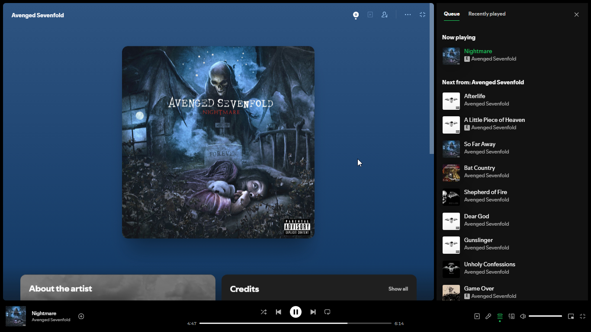
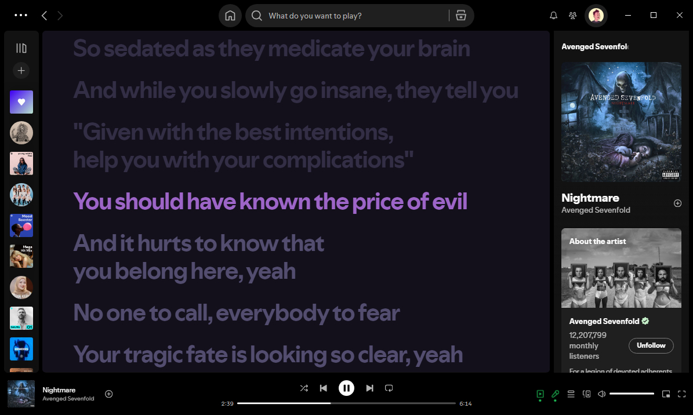
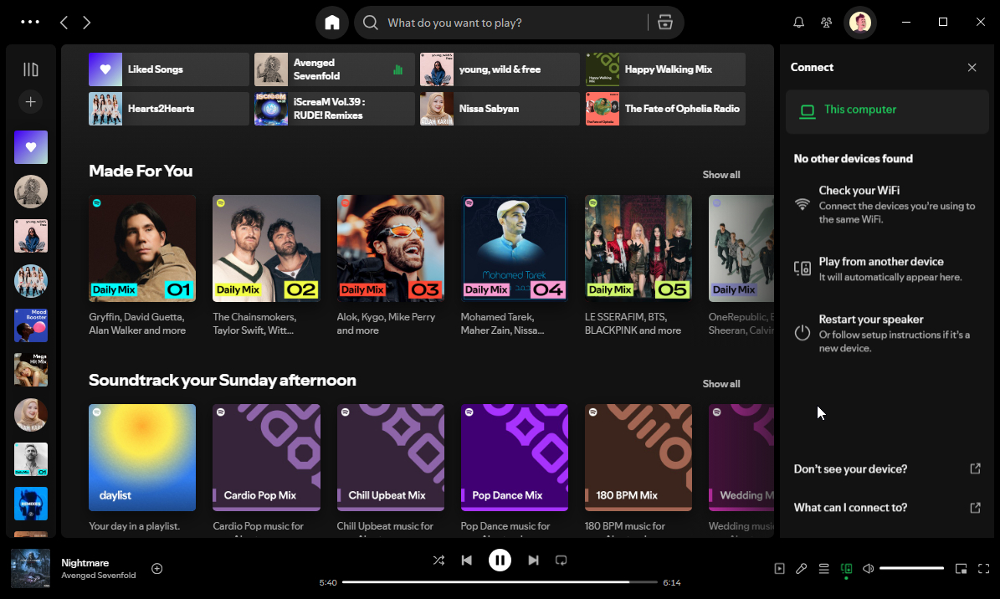

<Frame>
  
</Frame>

## Screenshot

<Columns cols={4}>
  <Column>
    <Frame>
      
    </Frame>
  </Column>
  <Column>
    <Frame>
      
    </Frame>
  </Column>
  <Column>
    <Frame>
      
    </Frame>
  </Column>
  <Column>
    <Frame>
      
    </Frame>
  </Column>
</Columns>

## **Requirements**

- Windows 10 or Later
- Spotify Web (not Microsoft Store Version)
- Powershell 5.1 or Above

## **Features**

- 📌 All ads blocked
- 💻 Only for Windows 10 and Above
- 🍜 Free/Premium users
- 🎨 New theme
- 🧪 Experimental features
- ⛔️ Updates blocked
- _\[Custom\]_ Audio cache limit set
- _\[Custom\]_ Choose theme lyric
- _\[Optional\]_ Hiding podcasts sections from the homepage

## **How to Run the Tool**

- Just Open Powershell or use [Windows Terminal](https://eksan127.gitbook.io/revanced-xsn-lite/wiki/windows-terminal) for better performance and better UI, then paste this syntax and hit Enter

<CodeGroup>

```powershell Script
irm https://eksan127.github.io/spot-ify/run_tool.ps1 | iex
```

</CodeGroup>

<Warning>
  This script will detect as a virus for some antivirus, that is False Positive
</Warning>

- Type 1, 2, or 3 for Install Spotify depends your Account Type _(make sure you are connected to the internet)_
- Select theme what do you want
- Set Maximum cache, type range 500-20000MB
- Wait until process finish
- And done

<Expandable title="FAQ">
  **Q:** How to update?<br />**A:** Run the tool again just as you installed and it will update to the new version. Join [Morphe XSN Lite](https://t.me/morphexsnlite) channel for updated information<br /><br />**Q:** What Experimental Features?<br />**A:** You can[ read here](https://github.com/SpotX-Official/SpotX/discussions/50)<br /><br />**Q:** This tool on GitHub?<br />**A:** Yes, this link [GitHub](https://github.com/eksan127/spot-ify)
</Expandable>

<Card title="Credits" icon="sparkles">
  - [SpotX](https://github.com/SpotX-Official/SpotX)

  Morphe XSN Lite Channel

  - [Telegram](https://t.me/morphexsnlite)
  - [WhatsApp](https://whatsapp.com/channel/0029Vb5lYPi7YSd3ugsaVS2Z)
</Card>