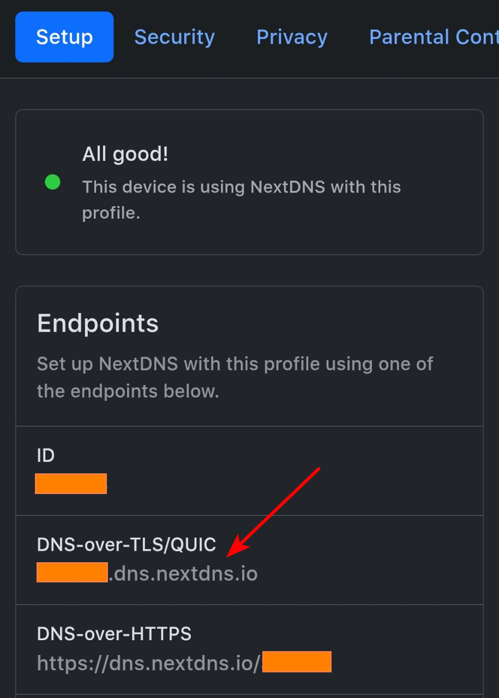

## **Summary**

Spotify constantly attempts to connect to the various ad and analytics servers it uses in the background. Targeted DNS filtering prevents the app from loading ad requests. This is the purpose of blocking, allowing you to play songs without ads.

## **Requirement**

- You need NextDNS Account for configuration, you can create account here

<Columns cols={2}>
  <Column>
    <Card title="NextDNS" icon="shield" iconType="solid" horizontal href="https://nextdns.io/" arrow="true">
      Create Account
    </Card>
  </Column>
  <Column>
  </Column>
</Columns>

- Android and iOS support Private DNS
- Spotify App with login account

## **Start Settings**

- After you create account and you have active Account, now open dashboard NextDNS
- Then go to Tab "Privacy" because you need active various filters in Blocklist, this list blocklist you must be active \[Add a Blocklist\]

<Accordion title="Enable on Blocklist">
  1. CHEF-KOCH's HOSTS Spotify Ad-Filter List
  2. HaGeZi - Multi PRO
  3. Steven Black
  4. NextDNS Ads & Trackers Blocklist
  5. AdGuard DNS filter
  6. AdGuard Mobile Ads filter
</Accordion>

- Next step, go to tab "Denylist" for spesific domain blocking, please add all this domain one by one on your Denylist

<Accordion title="List domains">
  \*.[payments.spotify.com](http://payments.spotify.com) \*.[checkout.spotifycdn.com](http://checkout.spotifycdn.com) \*.[api.spotify.com](http://api.spotify.com) \*.[g2.spotify.com](http://g2.spotify.com) \*.[desktop.spotify.com](http://desktop.spotify.com) \*.[ads.spotify.com](http://ads.spotify.com) \*.[spclient.wg.spotify.com](http://spclient.wg.spotify.com) \*.[audio-ak-spotify-com.akamaized.net](http://audio-ak-spotify-com.akamaized.net) \*.[audio2.spotify.com](http://audio2.spotify.com) \*.[analytics.spotify.com](http://analytics.spotify.com) \*.[adstats.spotify.com](http://adstats.spotify.com) \*.[adeventtracker.spotify.com](http://adeventtracker.spotify.com)
</Accordion>

- After that go to Tab "Allowlist" then add this list, this for ensure Spotify can login normally

<Info>
  \*.[login5.spotify.com](http://login5.spotify.com)
</Info>

- All is set, now go to Tab "Setup" then copy your address DNS-over-TLS/Quic and paste to your Private DNS in your Phone

<Frame>
  
</Frame>

- Now turn on airplane mode on your phone then turn off for reset your network
- Open your Spotify and try a Song

<Card title="Info" icon="info-circle">
  - I got all of this from various sources that I've read, so there's a chance it won't work, but you can try it.
  - This method only for minimizing advertisements on Spotify not unlocking Premium Features
</Card>

<Card title="Morphe XSN Lite Channel" icon="sparkles">
  - [Telegram](https://t.me/morphexsnlite)
  - [WhatsApp](https://whatsapp.com/channel/0029Vb5lYPi7YSd3ugsaVS2Z)
</Card>
